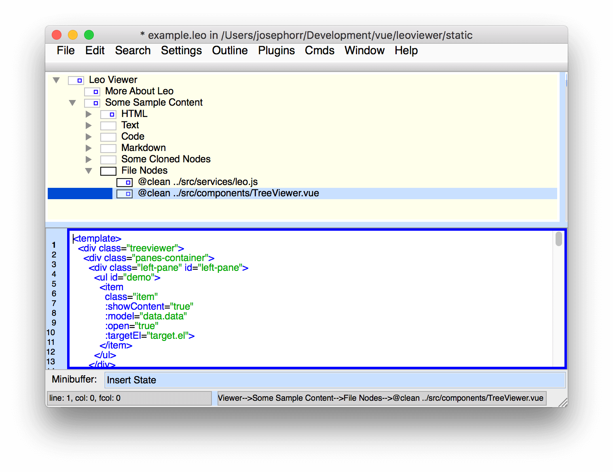
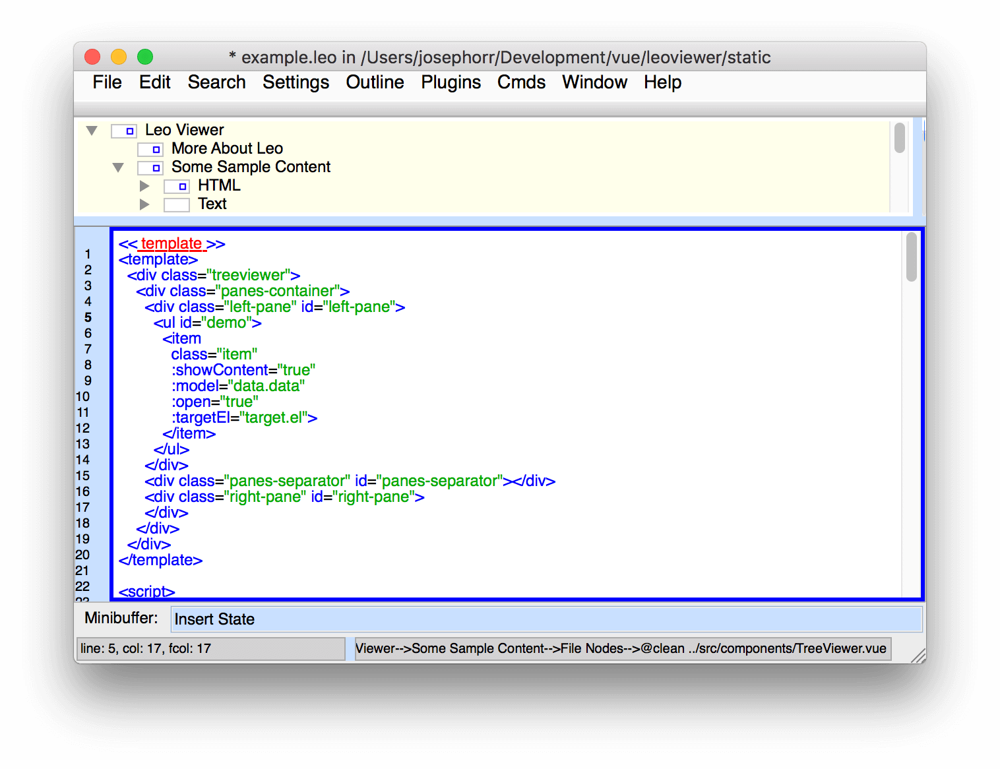
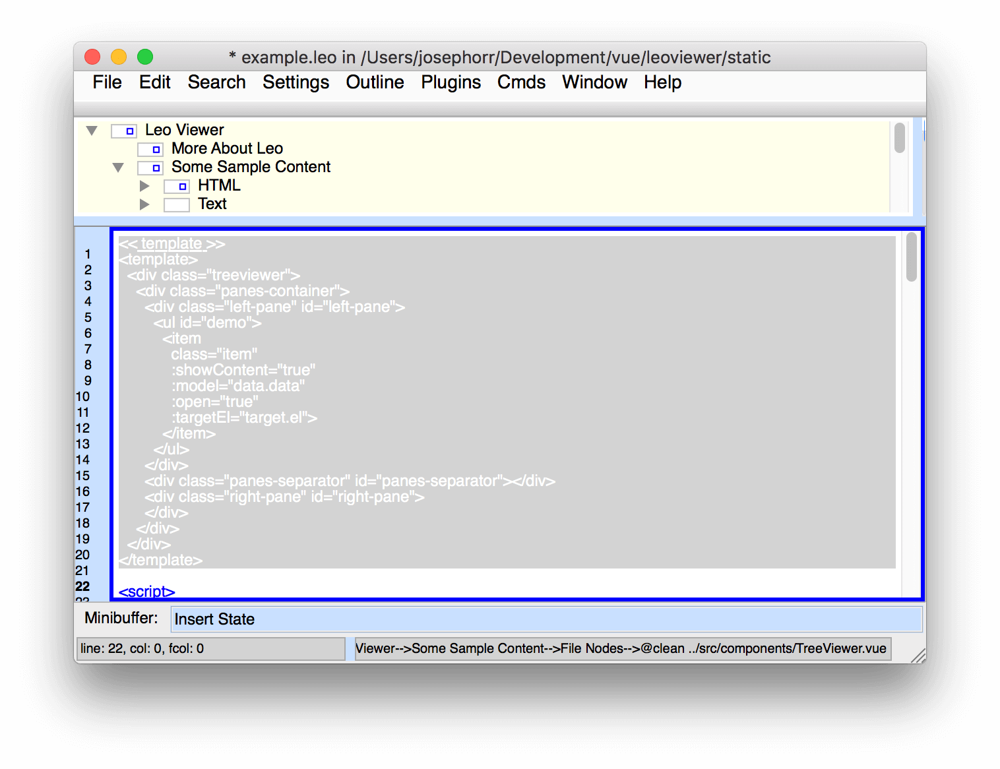
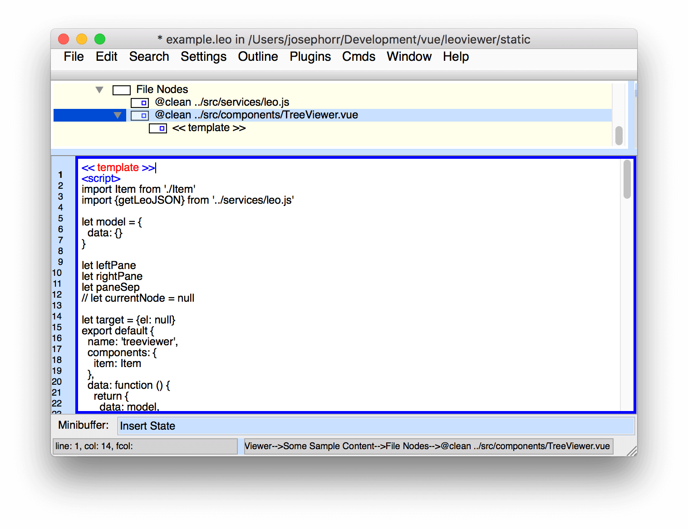
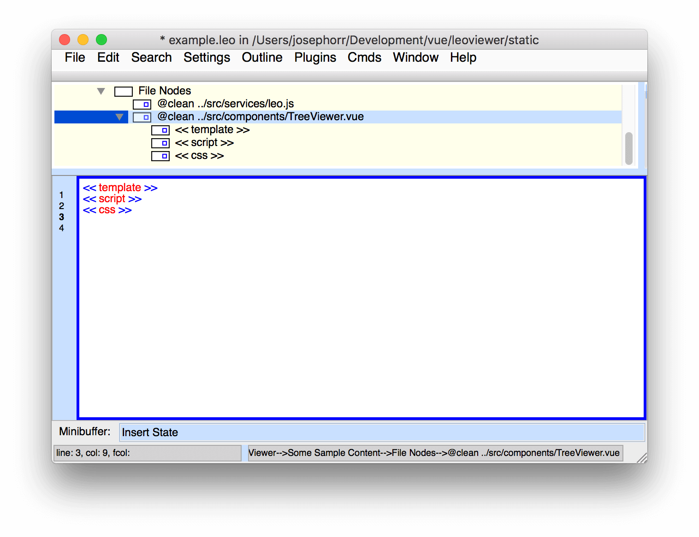

# Code Chunking

In the screenshot below, we've created a new node with a @clean directive with a file name. 
We've pasted the contents of the file into the node.

This is a Vuejs component file, with three sections. We're going to break the 
sections out into separate nodes. First create a section name using double angle brackets.

Now select the section name plus the code you want to put in a sub node.

Enter Cmd-Shift-D to chunk the selected content into a subnode.

Repeat this process with the other sections of the Vuejs component, now each has its own node. 

This is a simple example, but using Leo it is possible to quickly break up a large,
complex set of code into manageable pieces. The target file is not affected,
and if the target file is changed in another program, Leo will update the appropriate nodes.
