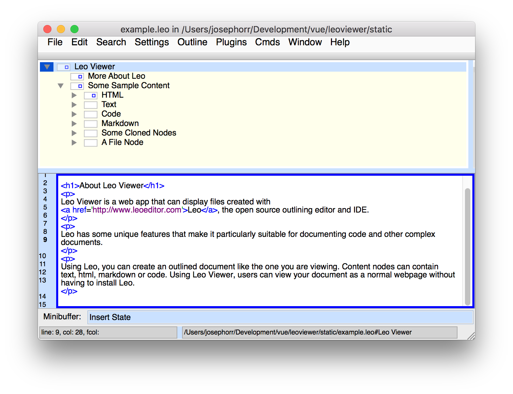
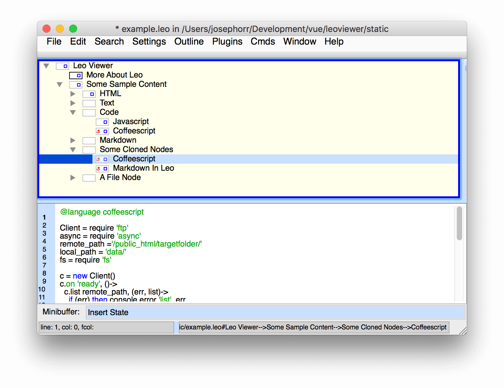
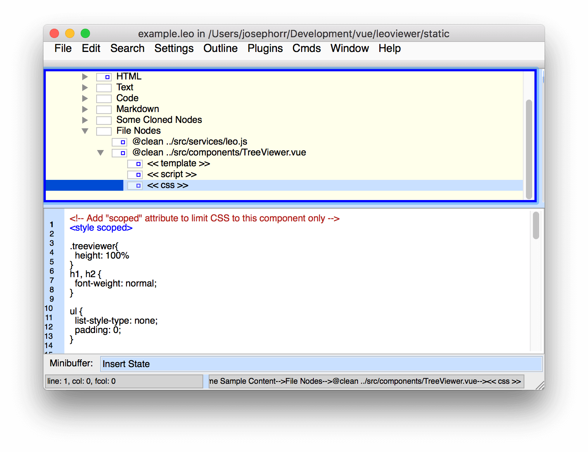

# Leo Is an Outlining Editor

In the screenshot below, you can see an outline or tree in the top left pane, and content for current node being entered into the bottom pane.

# Leo Outlines can contain Cloned Nodes

A single node can appear in multiple places in your tree, this is called a "clone" node. This allows Leo Outlines to be in effect, three dimensional and arbitrarily complex.

In the screenshot below, the "Coffeescript" node has been cloned and is appearing in two places in the tree. When you edit the content of the node and then click on its clone, you'll see that the edited content shows on both.

# Leo Outlines can mirror other files

The screenshot below shows a node with a '@clean' directive. This tells Leo that the content of the node should mirror the file specified by the directive.

This means that, when the target file is updated by another program, the content in the node will automatically update in Leo, regardless of whether that content has been divided into subnodes by Leo. To see how this works, read the next section: <b>Chunking</b>.

